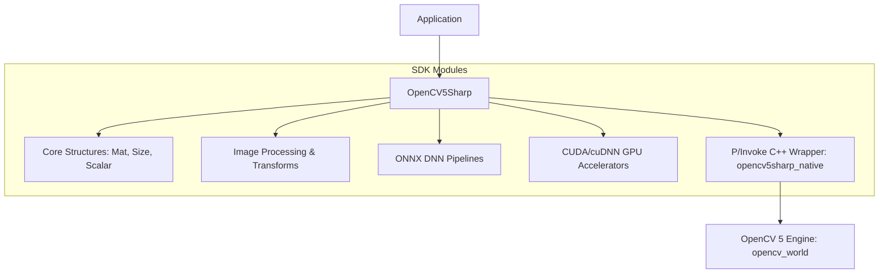

# OpenCV5Sharp

**by [Qourex](https://qourex.com)** — Bringing high-performance computer vision to .NET

[](https://github.com/qourex/opencv5sharp/actions/workflows/build.yml)
[](https://www.nuget.org/packages/OpenCV5Sharp)
[](https://www.nuget.org/packages/OpenCV5Sharp)
[](https://qourex.github.io/opencv5sharp/)
[](LICENSE)
[](https://dotnet.microsoft.com)

📖 **[Read the Documentation](https://qourex.github.io/opencv5sharp/)** for detailed guides, C# samples, and mobile deployment walkthroughs.
🚀 **[GPU Acceleration Guide](README_GPU.md)** for CUDA-enabled development.

---

**OpenCV5Sharp** is a production-ready C# wrapper for **OpenCV 5.x**. It provides a clean, automatic .NET API mapping of OpenCV's core computer vision algorithms.

The project features robust `IDisposable` memory management patterns, allowing developers to write high-performance image processing, feature detection, object tracking, and deep learning pipelines in modern C# without native memory leaks.

---

## ❓ Why OpenCV5Sharp?

OpenCV5Sharp focuses on delivering a complete, optimized .NET developer experience:

- **🔌 Native .NET API Surface** — Elegant, idiomatic C# wrappers covering 2,600+ OpenCV methods.
- **⚡ OpenCV 5 Backend** — High-performance execution powered by compiled OpenCV 5 native libraries.
- **🎮 GPU Acceleration** — Native CUDA and cuDNN support for fast pixel manipulation and DNN runs.
- **📱 Cross-Platform Interop** — First-class support for Windows, Linux, macOS, Android, and iOS using runtime identifiers (RIDs).
- **🔒 Automated Memory Cleanup** — Built-in `IDisposable` wrappers that clean up unmanaged pointers deterministically.
- **🤖 Deep Learning (DNN)** — Direct ONNX model support for face detection (YuNet) and image classification.
- **📦 Workload Isolation** — Dynamically strips unused platform binaries to reduce mobile package size.
- **✅ Automated Verification** — Extensive test suite validating interop methods and library layouts.

---

## 🏥 Project Health

| Metric | Value |
| :--- | :--- |
| **Native Backend** | OpenCV 5.0.0 |
| **License** | Apache-2.0 (Wrapper) / LGPL-2.1-or-later (FFmpeg) |
| **Target Frameworks** | .NET 8.0, .NET 9.0, .NET 10.0 |
| **Supported OS** | Windows (x64), Linux (x64), macOS (x64, ARM64), Android (ARM64), iOS (ARM64) |
| **Languages** | C#, C++, CUDA |

---

## 🎯 Feature Matrix

| Capability | Support |
| :--- | :---: |
| **Image Processing & Filtering** | ✅ |
| **Feature & Corner Detection** | ✅ |
| **Object Tracking & Optical Flow** | ✅ |
| **ArUco Marker Detection** | ✅ |
| **Image Inpainting & Restoration** | ✅ |
| **Deep Learning Inference (DNN)** | ✅ |
| **CUDA GPU Acceleration** | ✅ |
| **IDisposable Memory Management** | ✅ |

---

## 📐 Architecture

Below is a high-level overview of the library's interop layer:



---

## 💻 Quick Start

Here is a copy-pasteable example showing Canny Edge Detection:

```csharp
using System;
using OpenCV5Sharp;

class Program
{
    static void Main()
    {
        // 1. Load an image from disk
        using var src = Cv2.Imread("lena.jpg", (int)ImreadModes.Color);
        if (src == null || src.Handle == IntPtr.Zero)
        {
            Console.WriteLine("Could not load image.");
            return;
        }

        // 2. Prepare workspace matrices
        using var gray = new Mat();
        using var edges = new Mat();

        // 3. Convert to grayscale and run Canny Filter
        Cv2.CvtColor(src, gray, (int)ColorConversionCodes.Bgr2gray, 0, AlgorithmHint.Default);
        Cv2.Canny(gray, edges, 50, 150, 3, false);

        // 4. Save the output
        Cv2.Imwrite("edges.png", edges, IntPtr.Zero);
        Console.WriteLine("Edge detection complete!");
    }
}
```

---

## 🧪 Running the Test Suite

OpenCV5Sharp comes with a comprehensive test suite targeting both `.NET 8.0` and `.NET 9.0` frameworks with **618 unique test cases** (running **1,236 test runs** in total). The suite verifies memory layout padding, exception boundaries, API calling conventions, DNN model inference, and GPU calculations.

To run the test suite locally:
```bash
dotnet test
```

*Note: CUDA GPU tests (`CudaTests.cs`) utilize dynamic device queries and will automatically skip on machines without a configured CUDA runtime, keeping the test runner green across both CPU and GPU development machines.*

---

## 📄 License

The managed wrapper code and native compile scripts are licensed under the **Apache License, Version 2.0**.
Bundled native FFmpeg binaries linked dynamically are licensed under the **GNU LGPL v2.1 or later**.
See the [LICENSE](LICENSE) and [LICENSE_FFMPEG.txt](LICENSE_FFMPEG.txt) files for complete details.
